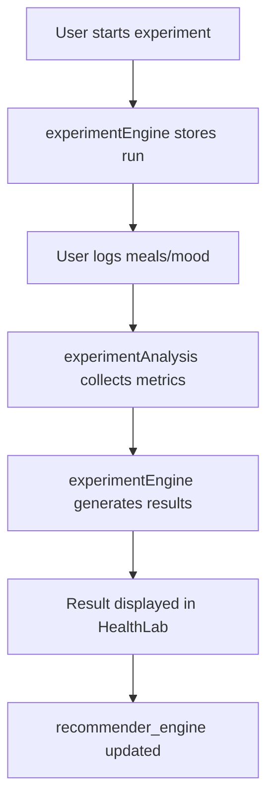

# HealthLab Experiments: Full Development Plan
## Adaptive Decision Engine Extension

---

### 1. Goal
Implement a **HealthLab experiment system** that allows users to run short behavioral experiments (3–7 days) to measure the effect of specific habits on mood, energy, and stress.

**The system will:**
- Propose experiments.
- Track experiment participation.
- Compute baseline metrics.
- Compare experiment outcomes.
- Generate results and insights.

**Integration Scope:**
The feature must integrate with the following existing modules:
- `pattern_engine`
- `recommender_engine`
- Meal logging
- Symptom/Mood logging
- Firestore storage

---

### 2. Feature Summary
HealthLab allows users to run structured experiments.

**Example: Protein Breakfast**
- **Hypothesis**: Protein breakfasts improve afternoon energy.
- **Duration**: 5 days
- **Metric**: Energy between 2:00 PM – 4:00 PM.

**Result Generation:**
- **Outcome**: "Energy improved +18% | Confidence: Medium."
- **Recommendation**: "Continue this habit."

---

### 3. Core System Components

#### Module 1: Experiment Definitions
**File**: `src/services/healthlab/experimentDefinitions.ts`

**Structure:**
```typescript
export type ExperimentDefinition = {
  id: string;
  name: string;
  category: string;
  hypothesis: string;
  durationDays: number;
  baselineWindowDays: number;
  targetMetric: string;
  requiredEvents: string[];
}
```

**Example Object:**
```json
{
 "id": "protein_breakfast",
 "name": "Protein Breakfast",
 "category": "nutrition",
 "hypothesis": "Protein breakfasts improve afternoon energy",
 "durationDays": 5,
 "baselineWindowDays": 7,
 "targetMetric": "afternoon_energy",
 "requiredEvents": ["breakfast_log", "energy_log"]
}
```

---

#### Module 2: Experiment Engine
**File**: `src/services/healthlab/experimentEngine.ts`

**Responsibilities:**
- `startExperiment`
- `trackProgress`
- `checkCompletion`
- `computeBaseline`
- `computeExperimentMetrics`
- `generateResults`

**Key Methods:**
- `startExperiment(userId, experimentId)`
- `getActiveExperiment(userId)`
- `getExperimentProgress(userId)`
- `completeExperiment(experimentRunId)`

---

#### Module 3: Experiment Analysis
**File**: `src/services/healthlab/experimentAnalysis.ts`

**Responsibilities:**
- Baseline calculation
- Metric aggregation
- Effect size calculation
- Confidence scoring

**Formulas:**
- **Baseline**: `average(metric over previous 7 days)`
- **Experiment Window**: `average(metric during experiment)`
- **Effect Size**: `delta = experimentMetric - baseline`

**Example Return:**
```typescript
{
 "delta": 0.6,
 "percentChange": 18,
 "confidence": "medium"
}
```

---

#### Module 4: Experiment Recommendation
**File**: `src/services/healthlab/experimentRecommendationService.ts`

**Input:**
- `pattern_engine` output
- Recent behavior history

**Example Rule:**
> *If Pattern* = `late_night_snacking`  
> *Then Suggest Experiment* = `no_food_after_9pm`

---

#### Module 5: Experiment Storage
**Firestore Collection**: `experiment_runs`

**Schema:**
- `id`
- `userId`
- `experimentId`
- `startDate`
- `endDate`
- `baselineMetrics`
- `experimentMetrics`
- `resultDelta`
- `confidenceScore`
- `status` (`active` | `completed` | `abandoned`)

---

### 4. UI Components

#### HealthLab Screen
- **File**: `src/app/healthlab/index.tsx`
- **Displays**: Active experiment, progress, suggested experiments, and history.

#### Experiment Detail Screen
- **File**: `src/app/healthlab/experiment/[id].tsx`
- **Displays**: Hypothesis, duration, metrics tracked, and start button.

#### Experiment Progress Card
- **File**: `src/components/ExperimentProgressCard.tsx`
- **Displays**: Experiment name, day progress, and compliance indicator.

#### Experiment Result Screen
- **File**: `src/app/healthlab/results/[id].tsx`
- **Displays**: Outcome, effect size, confidence, and system recommendation.

---

### 5. Experiment Metrics
Initial metrics to be computed from existing logs:
- `avg_mood` (from SymptomEvents)
- `avg_energy`
- `stress_frequency`
- `late_night_meal_count`
- `meal_timing_variance`

---

### 6. Initial Experiment Library
Starter library (5 experiments):
1. **Protein Breakfast**: `targetMetric: afternoon_energy` | `duration: 5 days`
2. **No Late Snacks**: `targetMetric: next_day_energy` | `duration: 4 days`
3. **Hydration Before Meals**: `targetMetric: mood_stability` | `duration: 5 days`
4. **Protein Snack at 3 PM**: `targetMetric: afternoon_energy` | `duration: 5 days`
5. **60-Second Stress Reset**: `targetMetric: stress_frequency` | `duration: 5 days`

---

### 7. Development Phases

- **Phase 1: Infrastructure**: data models, `experimentEngine.ts`, `experiment_runs` collection, and `HealthLabScreen`. (Capabilities: start, track, baseline, result).
- **Phase 2: Analysis Engine**: `experimentAnalysis.ts`, effect size calculation, and confidence scoring.
- **Phase 3: Pattern Integration**: `experimentRecommendationService.ts` and pattern-to-experiment mapping.
- **Phase 4: Engagement Layer**: Progress UI, mid-experiment feedback, and experiment history.
- **Phase 5: Knowledge Layer**: Food impact profiles and long-term habit improvement logic.

---

### 8. Data Flow


---

### 9. Testing Plan
- Baseline calculation correctness.
- Experiment window detection.
- Effect size computation.
- Confidence scoring logic.
- Experiment completion triggers.

---

### 10. Documentation Deliverables
- `HEALTHLAB_ARCHITECTURE.md`
- `EXPERIMENT_LIBRARY.md`
- `EXPERIMENT_ANALYSIS_METHOD.md`
*(Explaining design, analysis method, and integration with the existing engine)*

---

### 11. Success Criteria
**User Engagement:**
- Users start experiments.
- Users complete experiments.
- Users view results and adopt recommendations.

**Key Metrics:**
- Experiment completion rate.
- Retention improvement.
- Recommendation adoption rate.

---

### 12. Future Enhancements
- Adaptive experiment selection.
- Multi-variable experiments.
- Population-level insights.
- Experiment streaks.
- Shareable experiment results.